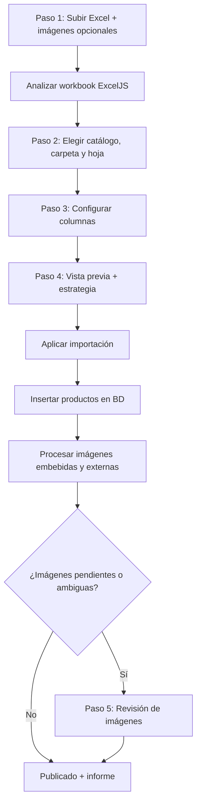

# METHOD-IMPORT — Importador de Excel (catálogos)

Documento técnico que describe **cómo funciona hoy el importador de Excel** en este proyecto, según el código en `src/server`, `src/features/imports` y las APIs bajo `/api/admin/imports`.

**Alcance:** importación de **catálogos** (productos en carpetas). No cubre listas de precios ni la pantalla `/admin/archivos` (historial de archivos), que aún no está cableada al flujo real.

**Última revisión:** basada en el código del repositorio al momento de redactar este documento.

---

## 1. Vista general

El importador convierte **una hoja de un archivo Excel** en **productos** dentro de **una carpeta** de un **catálogo**. Opcionalmente procesa **imágenes embebidas** en el Excel y **imágenes externas** (ZIP o archivos sueltos) asociadas por nombre de archivo.



### Punto de entrada en la UI

- Pantalla: `/admin/catalogos`
- Componente: `ImportWizard` (modal)
- Se abre desde el botón **Importar Excel** en `CatalogNavigator`
- Requiere rol **ADMIN**

---

## 2. Pasos del asistente (frontend)

| Paso interno | Etiqueta en UI | Componente | Qué hace el usuario |
|--------------|---------------|------------|---------------------|
| `upload` | Archivo | `ImportStepUpload`, `ImportExternalImagesPanel` | Sube `.xlsx` o `.xlsm`. Opcional: ZIP o imágenes sueltas para vincular después. |
| `destination` | Destino | `ImportStepDestination` | Elige catálogo, carpeta y **hoja importable**. Puede crear catálogo/carpeta inline. |
| `columns` | Columnas | `ImportStepColumns` | Define código principal (o **Generar Códigos**), y por cada columna del Excel si se crea columna en la carpeta (Sí/No). |
| `preview` | Vista previa | `ImportStepPreview` | Revisa resumen y elige estrategia: importar / combinar / reemplazar. |
| `imageReview` | (mismo indicador que vista previa) | `ImportStepImageReview` | Solo si quedan imágenes `PENDING_REVIEW` tras aplicar. |
| `result` | Resultado | `ImportStepResult` | Mensaje final de éxito o error. |

Cada paso muestra un **hint contextual** en el header del modal (`import-wizard-step-hints.ts`).

### Llamadas principales frontend → backend

| Momento | Acción / endpoint |
|---------|-------------------|
| Subir Excel | `POST /api/admin/imports/upload` |
| Analizar | `analyzeImportAction({ jobId })` |
| Listar hojas | `GET /api/admin/imports/{jobId}/sheets` |
| Destino | `setImportDestinationAction` |
| Imágenes externas (si no se subieron al inicio) | `POST /api/admin/imports/{jobId}/images` |
| Columnas de carpeta | `GET /api/admin/folders/{folderId}/products?page=1&pageSize=1` |
| Config + preview | `setImportConfigAction` → `GET /api/admin/imports/{jobId}/preview` |
| Aplicar | `applyImportAction({ actionType, confirmed })` |
| Revisión imágenes | `listImportImageReviewAction`, `associateImportImageAction`, `deleteImportImageAction`, `completeImageReviewAction` |
| Informe | `GET /api/admin/imports/{jobId}/report` |
| Cerrar wizard antes de terminar | `cancelImportAction` |

Server actions: `src/features/imports/actions/import.actions.ts`.

---

## 3. Estados del trabajo de importación (`ImportJob`)

| Estado | Significado |
|--------|-------------|
| `STORED` | Excel guardado en Storage (`EXCEL_ORIGINALS`). |
| `ANALYZING` | Leyendo el workbook con ExcelJS. |
| `PENDING_DESTINATION` | Hojas parseadas; falta catálogo/carpeta/hoja. |
| `PENDING_CONFIG` | Destino definido; falta configuración de columnas. |
| `PROCESSING` | Generando preview o aplicando importación. |
| `READY_TO_APPLY` | Preview persistido; listo para confirmar. |
| `PENDING_REVIEW` | Productos importados; hay imágenes por revisar. |
| `PUBLISHED` | Importación finalizada. |
| `FAILED` | Error terminal. |
| `CANCELLED` | Usuario cerró el wizard antes de publicar. |

Orquestación central: `src/server/services/catalog-import.service.ts`.

---

## 4. Lectura del Excel (ExcelJS)

**Librería:** `exceljs`  
**Archivos clave:**

- `src/server/importers/excel-workbook.parser.ts` — carga el buffer
- `src/server/importers/excel-sheet.parser.ts` — hoja → headers + filas
- `src/server/importers/excel-cell.extractor.ts` — valor de cada celda
- `src/server/importers/excel-image.detector.ts` — conteo de imágenes por fila

### 4.1 Detección de fila de encabezados

- Se escanean las **primeras 20 filas**.
- La primera fila con **≥ 2 celdas no vacías** se toma como fila de encabezados.
- Si no se encuentra: la hoja queda sin encabezados tabulares y se clasifica como auxiliar.

### 4.2 Columnas detectadas

Una columna se incluye si:

- Tiene texto en el encabezado, **o**
- Tiene datos en alguna fila debajo del encabezado.

Si el encabezado está vacío pero hay datos → nombre sintético `Columna N` (N = número de columna en Excel).

Cada encabezado recibe un `internalKey` slugificado (sin acentos, minúsculas, guiones bajos, deduplicado).

### 4.3 Filas de datos

- Desde `filaEncabezado + 1` hasta el final de la hoja.
- Se **omiten** filas donde **todas** las columnas mapeadas están vacías.
- `rowCount` en el sheet parseado = **filas de datos**, no filas totales del Excel.

### 4.4 Valores de celda

| Caso | Comportamiento |
|------|----------------|
| Texto plano | Se importa tal cual |
| Texto enriquecido (`richText`) | Se concatenan los fragmentos de texto |
| Fecha | `toISOString()` |
| Hipervínculo | Se usa el `.text` visible |
| Fórmula con resultado cacheado | Se usa el **resultado** guardado en el archivo |
| Fórmula sin resultado cacheado | Se intenta el valor mostrado; se registra **warning** (`formulasWithoutCachedValue`) |

**Importante:** el sistema **no ejecuta fórmulas**. Solo lee lo que Excel guardó al guardar el archivo.

### 4.5 Celdas combinadas (merged cells)

**No implementado.** No hay lectura de rangos combinados. En la práctica, ExcelJS suele dejar el valor solo en la celda ancla; el resto puede quedar vacío.

### 4.6 Formatos de archivo admitidos

| Admitido | No admitido |
|----------|-------------|
| `.xlsx` | `.xls` (Excel 97-2003) |
| `.xlsm` (macros como contenedor, **sin ejecutar macros**) | CSV |

---

## 5. Clasificación de hojas

Servicio: `src/server/services/excel-structure.service.ts`

| Clasificación | Criterio |
|---------------|----------|
| `INDEX` | Nombre tipo `Índice`, `Indice`, `Index`, … |
| `IGNORED` | `Sheet1`, `Hoja1`, `temp*`, nombre vacío, 0 filas |
| `AUXILIARY` | Sin encabezados tabulares (< 2 columnas detectadas) |
| `IMPORTABLE` | Resto de hojas con estructura tabular |

Solo las hojas **`IMPORTABLE`** pueden elegirse en el paso Destino.

---

## 6. Mapeo de columnas

### 6.1 Paso Columnas (UI actual)

1. **Columna código principal**
   - Selector buscable (`ImportSearchableSelect`) sobre encabezados del Excel.
   - Alternativa: botón **Generar Códigos** → `useGeneratedPrimaryCodes: true`.
   - Con códigos generados, el selector de columna queda deshabilitado.

2. **Tabla “Columna Excel → Crear columna nueva”**
   - Por cada encabezado del Excel: **Sí** = importar y crear/usar columna; **No** = ignorar (`__ignore__`).
   - No hay UI para mapear manualmente a una columna existente de la carpeta por nombre distinto; el backend hace match automático por `originalName` si coincide.

### 6.2 Detección semántica por nombre de encabezado

Patrones en `column-mapper.ts` / `column-mapping.ts`:

| Rol | Patrones en el nombre |
|-----|----------------------|
| Código principal | `código`, `cod.`, `referencia`, `ref` |
| Descripción | `descripción`, `desc.`, `detalle` |
| Código de imagen | `imagen`, `image`, `foto`, `photo` |

Se usan al **crear columnas de carpeta** (`isPrimaryCode`, `isDescription`, `isImageCode`) y para **adivinar** código/descripción al iniciar el paso Columnas.

La **descripción** se infiere en backend al guardar config; **no hay selector de descripción en el wizard** (se eliminó de la UI).

### 6.3 Códigos generados automáticamente

Si el usuario activa **Generar Códigos**:

- Cada fila recibe un código aleatorio de **6 caracteres hex** (`randomBytes(3)`).
- Se crea/usa la columna `codigo_generado` (“Código”) como única `isPrimaryCode`.
- El matching de imágenes externas **no usa** `primaryCode` (`includePrimaryCodeInMatch: false`).
- Las imágenes externas deben coincidir por columnas `isImageCode` o revisión manual.

### 6.4 Cómo se guarda cada producto

Mapper: `src/server/importers/product-row.mapper.ts`

| Campo en `Product` | Origen |
|--------------------|--------|
| `primaryCode` | Columna principal elegida, o código generado |
| `normalizedCode` | `primaryCode` normalizado para matching (mayúsculas, sin espacios/guiones) |
| `description` | Columna con flag `isDescription` (config o detección semántica) |
| `dynamicData` | Resto de columnas importadas (`internalKey` → valor) |
| `originalText` | Todos los valores de la fila unidos con ` \| ` |
| `indexedText` | Texto para búsqueda (columnas buscables + equivalencias) |

Normalización para coincidencias: `normalizeCodeForMatch` — trim, mayúsculas, elimina espacios, `-`, `_`, `.`, `/`, `\`.

---

## 7. Vista previa y estrategias de aplicación

### 7.1 Vista previa

- Hasta **50 filas** en UI (`PREVIEW_ROW_LIMIT`).
- API paginada: `pageSize` máx. 200.
- Muestra productos reconocidos, coincidencias con carpeta existente, advertencias de fórmulas, conteo de imágenes detectadas en la hoja.

### 7.2 Estrategias (`ImportActionType`)

| Acción | Cuándo | Comportamiento |
|--------|--------|----------------|
| `IMPORTAR_LISTA` | Carpeta **vacía** (`productCount === 0`) | Inserta **todas** las filas mapeadas. |
| `COMBINAR_LISTA` | Carpeta con productos | Inserta solo filas cuyo `primaryCode` **no** coincide con un producto existente. **No actualiza** productos existentes. Requiere `confirmed: true`. |
| `REEMPLAZAR_LISTA` | Carpeta con productos | `deleteByFolder` + inserta todas las filas. Requiere `confirmed: true`. |

Después del insert:

- `equivalenceService.syncFromProduct` para **todos** los productos de la carpeta.
- Procesamiento de imágenes sobre **todas** las filas mapeadas del Excel (no solo las insertadas en COMBINAR).

Inserción en lotes de **500** productos (`BATCH_SIZE`).

---

## 8. Imágenes — visión general

Hay **dos orígenes** independientes:

1. **Embebidas** — dibujos/objetos dentro del `.xlsx`/`.xlsm`.
2. **Externas** — ZIP o archivos sueltos subidos en el wizard (“Vincular imágenes”).

Estados posibles (`ProductImageStatus`):

`ASSOCIATED_AUTO`, `ASSOCIATED_MANUAL`, `PENDING_REVIEW`, `AMBIGUOUS`, `DUPLICATE_NAME`, `FORMAT_REJECTED`, `FILE_NOT_FOUND` (enum definido, no asignado en código actual), `DELETED`.

---

## 9. Imágenes embebidas en Excel

### 9.1 Cómo las detecta el sistema

En el **parseo** (`excel-image.detector.ts`):

```ts
worksheet.getImages()  // API de ExcelJS
```

Por cada imagen:

- **Fila:** `range.tl.nativeRow + 1` o `range.tl.row` (1-based).
- Se cuenta cuántas imágenes hay por fila (`imagesByRow`) y el total en la hoja (`imageCount`).

En la **extracción** (`image-extraction.service.ts` → `listEmbeddedImageRefs`):

- Además de la fila, se guarda la **columna ancla** (`nativeCol` / `col`).
- Se resuelve el **nombre del encabezado** de esa columna (`sourceColumn` / `label`).

### 9.2 Cómo se asocian a productos

Tras insertar productos, se construye un mapa **`número de fila Excel → productId`** comparando `primaryCode` de cada fila mapeada con los productos recién creados en la carpeta.

Para cada imagen embebida:

1. Se obtiene el binario desde `workbook.model.media[]` por `imageId`.
2. Se valida con Sharp / magic bytes (solo **JPEG, PNG, WebP**).
3. Si hay `productId` para esa **fila** → `ASSOCIATED_AUTO`, sube a `PRODUCT_IMAGES` + miniatura WebP.
4. Si **no** hay producto para esa fila → `PENDING_REVIEW`, archivo en `TEMP_IMPORTS`.

### 9.3 Varias imágenes en la misma fila

**Sí, soportado.**

- Todas las imágenes de la **misma fila** apuntan al **mismo producto** (mismo `rowToProductId`).
- `sortOrder` incrementa por imagen dentro del producto.
- La **primera** imagen asociada de ese producto queda con `isPrimary: true`; las siguientes `isPrimary: false`.

No se usa la columna ancla para decidir el producto en embebidas — solo la **fila**.

### 9.4 Imagen y texto en la misma celda

En Excel, una imagen “flotante” y el texto de una celda son **capas distintas**:

| Capa | Qué hace el importador |
|------|------------------------|
| **Texto de la celda** | Se lee con `extractCellValue` → va a `dynamicData`, `description` o `primaryCode` según el mapeo de columnas. |
| **Imagen dibujada** | Se lee por ancla de fila/columna vía `getImages()` → flujo de imágenes embebidas. |

**No hay lógica especial** que combine imagen+texto en un solo campo. Si el Excel tiene una imagen superpuesta sobre una celda con texto:

- El **texto** se importa como dato de columna.
- La **imagen** se importa como `ProductImage` vinculada a la fila.

Si la celda solo contiene imagen sin texto (común en catálogos visuales), el valor de celda puede quedar vacío y solo existirá la imagen asociada por fila.

### 9.5 Imagen en fila sin producto insertado

Ocurre si la fila fue omitida (fila vacía), o en **COMBINAR** cuando el código ya existía y no se insertó producto nuevo. La imagen queda en `PENDING_REVIEW`.

### 9.6 Imagen corrupta o formato no válido

→ `FORMAT_REJECTED`, registro en BD con `errorMessage`, warning en el informe.

---

## 10. Imágenes externas (ZIP / sueltas)

### 10.1 Subida

- En paso **Archivo**: panel **Vincular imágenes** (`ImportExternalImagesPanel`).
- Formatos: `.zip`, `.jpg`, `.jpeg`, `.png`, `.webp`.
- También se pueden subir después vía `POST /api/admin/imports/{jobId}/images`.
- Referencias guardadas en `ImportJob.config.externalImages`.

### 10.2 Extracción de ZIP

`src/server/image-processors/zip-extractor.ts`:

| Límite | Valor |
|--------|-------|
| Entradas de imagen | 500 máx. |
| Tamaño descomprimido total | 200 MB |
| Tamaño por entrada | 10 MB |
| Extensiones | `.jpg`, `.jpeg`, `.png`, `.webp` |

Rutas inseguras (`..`, absolutas) y entradas que no son imagen se **omiten silenciosamente**.

### 10.3 Matching por nombre de archivo

Servicio: `src/server/services/image-matching.service.ts`

1. Se normaliza el nombre **sin extensión** con la misma regla que los códigos de producto.
2. Se busca en un índice construido desde:
   - `primaryCode` y `normalizedCode` de cada producto (salvo si `useGeneratedPrimaryCodes`),
   - Valores en columnas con `isImageCode: true` en `dynamicData`.

| Resultado | Estado | Acción |
|-----------|--------|--------|
| 1 producto coincide | `ASSOCIATED_AUTO` | Mueve a storage definitivo del producto |
| 0 coincidencias | `PENDING_REVIEW` | Queda en staging |
| >1 coincidencias | `AMBIGUOUS` | Guarda `matchCandidates`; queda en staging |
| Mismo nombre de archivo repetido en el lote | `DUPLICATE_NAME` | Rechazado |

Ejemplo del PRD: `PLACA-55120IAR.jpg` y `PLACA-55120IAR` (sin extensión en otro contexto) matchean tras normalización.

---

## 11. Revisión manual de imágenes

Paso `imageReview` — `ImportStepImageReview.tsx`

- Lista solo imágenes con estado **`PENDING_REVIEW`** (pageSize 200).
- Por imagen: elegir producto (`ProductSearchCombobox`), decidir **Vincular / Ignorar**.
- **Vincular** → `ASSOCIATED_MANUAL`.
- **Ignorar** → `DELETED` (soft delete).
- **Finalizar** → `completeImageReviewAction` → job `PUBLISHED`.

### Limitaciones actuales de la revisión

| Caso | Comportamiento |
|------|----------------|
| Imágenes `AMBIGUOUS` | El job pasa a `PENDING_REVIEW`, pero **la UI no las lista** (solo filtra `PENDING_REVIEW`). |
| `FORMAT_REJECTED`, `DUPLICATE_NAME` | No aparecen en el paso de revisión. |
| `FILE_NOT_FOUND` | Definido en schema; **nunca se asigna** en el código actual. |

El hint del header indica que se pueden ignorar imágenes para continuar.

---

## 12. Límites y validaciones

### 12.1 Tamaños de archivo

| Recurso | Límite en aplicación | Dónde |
|---------|---------------------|-------|
| Excel `.xlsx`/`.xlsm` | **50 MB** | `BUCKET_CONFIGS.EXCEL_ORIGINALS`, ruta upload |
| ZIP / imagen en import temporal | **50 MB** por archivo | `TEMP_IMPORTS`, `EXTERNAL_IMAGE_MAX_BYTES` (cliente) |
| Imagen de producto (storage final) | **10 MB** | `PRODUCT_IMAGES` |
| Body HTTP Next.js (proxy) | **55 MB** | `next.config.ts` → `experimental.proxyClientMaxBodySize` |

> **Nota:** Next acepta hasta 55 MB en el proxy, pero la **validación de negocio sigue en 50 MB**. Un archivo entre 50–55 MB será rechazado por la API aunque pase el proxy.

### 12.2 Otros límites

| Concepto | Valor |
|----------|-------|
| Lote de inserción de productos | 500 |
| Filas preview en UI | 50 |
| Rate limit import APIs | 20 req/min por IP (middleware) |

### 12.3 Seguridad

- Todas las rutas `/api/admin/imports/*` requieren **ADMIN**.
- Excel original en bucket **privado** (`EXCEL_ORIGINALS`).
- Imágenes de producto en bucket **privado**; URLs firmadas para visualización.
- Macros en `.xlsm`: **no se ejecutan**.

---

## 13. Informe de importación (`ImportReport`)

Persistido en `ImportJob.resultados` (JSON) al aplicar. Incluye:

- Archivo, catálogo, carpeta, hoja importada
- Productos procesados / creados / omitidos / coincidentes
- Fórmulas detectadas y sin valor cacheado
- Imágenes detectadas, extraídas, asociadas, pendientes, rechazadas, ambiguas
- Columnas detectadas y creadas
- `warnings`, `errors`, `actionApplied`

La UI del paso **Resultado** muestra un mensaje resumido; el informe completo está en BD y en `GET .../report`.

---

## 14. Qué está implementado vs. qué no

### Implementado hoy

- Asistente completo upload → destino → columnas → preview → (revisión imágenes) → resultado
- Parsing ExcelJS con headers, filas, fórmulas (valor cacheado), rich text, fechas
- Clasificación de hojas (importable / índice / auxiliar / ignorada)
- Tres estrategias de aplicación
- Imágenes embebidas por ancla de fila (múltiples por fila)
- Imágenes externas por nombre ↔ código / columna imagen
- Códigos generados automáticamente
- Miniaturas WebP (Sharp)
- Equivalencias post-import
- Auditoría al publicar

### No implementado o parcial

| Área | Estado |
|------|--------|
| Celdas combinadas | No tratadas |
| Evaluación de fórmulas | Solo valor guardado por Excel |
| `.xls`, CSV | No soportados |
| Ejecución de macros | No |
| UI historial `/admin/archivos` | Placeholder |
| Mapeo manual Excel → columna existente (nombre distinto) | Solo match automático por nombre |
| Selector de columna descripción en wizard | Removido; solo inferencia backend |
| Revisión UI de imágenes `AMBIGUOUS` | Parcial (existen en BD, no en lista) |
| COMBINAR actualizando productos existentes | Solo omite duplicados |
| Rollback transaccional de imágenes si falla apply | Productos en transacción; imágenes después |

---

## 15. Archivos clave (referencia rápida)

### Orquestación
- `src/server/services/catalog-import.service.ts`
- `src/features/imports/components/ImportWizard.tsx`
- `src/features/imports/actions/import.actions.ts`

### Excel
- `src/server/importers/excel-workbook.parser.ts`
- `src/server/importers/excel-sheet.parser.ts`
- `src/server/importers/excel-cell.extractor.ts`
- `src/server/importers/excel-image.detector.ts`
- `src/server/importers/product-row.mapper.ts`
- `src/server/importers/match-detector.ts`
- `src/server/importers/generated-primary-code.ts`

### Imágenes
- `src/server/services/image-extraction.service.ts`
- `src/server/services/image-matching.service.ts`
- `src/server/services/product-image.service.ts`
- `src/server/image-processors/zip-extractor.ts`
- `src/server/image-processors/image-integrity.ts`
- `src/server/image-processors/thumbnail.service.ts`

### UI import
- `src/features/imports/components/ImportStepUpload.tsx`
- `src/features/imports/components/ImportExternalImagesPanel.tsx`
- `src/features/imports/components/ImportStepDestination.tsx`
- `src/features/imports/components/ImportStepColumns.tsx`
- `src/features/imports/components/ImportStepPreview.tsx`
- `src/features/imports/components/ImportStepImageReview.tsx`
- `src/features/imports/components/ImportSearchableSelect.tsx`

### API
- `src/app/api/admin/imports/upload/route.ts`
- `src/app/api/admin/imports/[jobId]/sheets/route.ts`
- `src/app/api/admin/imports/[jobId]/preview/route.ts`
- `src/app/api/admin/imports/[jobId]/images/route.ts`
- `src/app/api/admin/imports/[jobId]/images/review/route.ts`
- `src/app/api/admin/imports/[jobId]/report/route.ts`

### Modelo
- `prisma/schema.prisma` — `ImportJob`, `ImportSheet`, `ImportPreview`, `Product`, `ProductImage`

### Configuración
- `src/server/storage/config.ts`
- `next.config.ts` — `proxyClientMaxBodySize`

---

## 16. Resumen: preguntas frecuentes

### ¿Cómo reconoce las imágenes embebidas?

Por `worksheet.getImages()` de ExcelJS, usando el ancla superior-izquierda (`tl`) de cada dibujo. La fila determina el producto; la columna solo se guarda como metadata (`sourceColumn`).

### ¿Qué pasa si hay más de una imagen por fila?

Todas se vinculan al mismo producto de esa fila. La primera es `isPrimary`; el resto tienen `sortOrder` incremental.

### ¿Qué pasa si en una celda hay imagen y texto?

Se procesan por separado: texto → datos del producto; imagen → `ProductImage` por ancla de fila. No se fusionan en un solo campo.

### ¿Cómo vincula imágenes externas del ZIP?

Por **nombre de archivo** (sin extensión), normalizado igual que los códigos de producto, contra `primaryCode` y columnas marcadas como código de imagen.

### ¿Hace falta migración de BD al cambiar límites de upload?

No. Cambios en `next.config.ts` o límites de Storage solo requieren **reiniciar el servidor** / redesplegar. Los límites de 50 MB vs 55 MB del proxy son independientes de Prisma.

---

*Este documento describe el comportamiento del código. Para requisitos de negocio y casos de catálogo (Rulemanes, Catálogo Azul, Embragues), ver también `docs/PRD.md`.*
